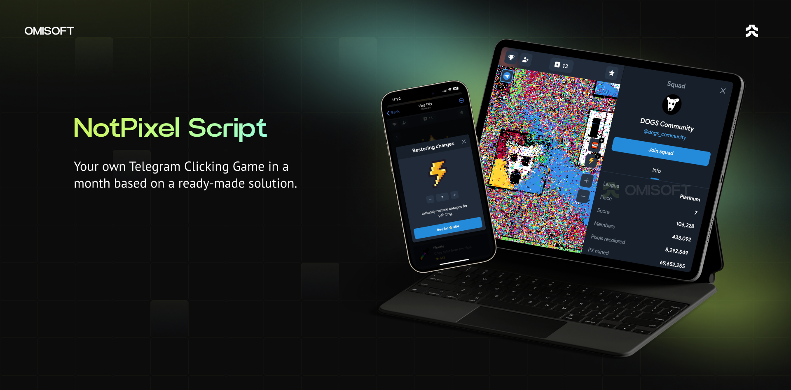

# NotPixel Clone Script Case Study | Web3 Telegram Game 

Welcome to the repository that showcases the foundation of the **NotPixel Clone Script**—an innovative Web3 Telegram Mini Game. This repository serves as both a technical demonstration of the app and a case study of how you can launch your custom NotPixel-like game with minimal time and financial investment.

**Want to launch a game like this?** We offer complete end-to-end product implementation so you can focus entirely on marketing and sales while we handle the technology.

---

## Why Choose This Solution?

This case study highlights how you can reduce time-to-market and costs by leveraging a white-label solution tailored to your brand and business needs. Our NotPixel Clone Script offers:

- A fully functional Web3 Telegram Mini App.
- Scalability and adaptability to include additional features, custom branding, and advanced integrations.
- Rapid deployment and expert support.

## Key Features Included in the Solution

### Core Features

- **Telegram Mini App**: Fully integrated within the Telegram platform.
- **Authorization via Telegram**: Secure user authentication.
- **Mobile Adaptation**: Optimized for a seamless mobile experience.
- **Admin Panel**: Simplified management of app settings and user activities.
- **Figma Design File**: Customizable UI/UX design file included.
- **Localization Support**: Multilingual options to target global audiences.
- **DDoS Protection**: Robust security for safe and uninterrupted gaming.
- **CI/CD Pipelines**: Automated deployments for updates and scalability.
- **Advanced Referral Program**: Built-in marketing mechanics to grow your community.
- **Analytics Tools**: Integration with Google Analytics and Microsoft Clarity for user insights.

### Additional Features Available on Request

- Landing Page  
- Blog Integration  
- Social Network Integration  
- Crypto Deposit & Withdrawal Support  
- Mobile App Development  
- Support Bot  
- Loot Boxes  
- Google AdSense Integration  
- Marketing Bonuses (Join Bonus, Daily Bonus, Competitions, etc.)  
- ...and any other feature your vision requires!

---

## Tech Stack Overview

Our NotPixel Clone Script is built with cutting-edge technologies to ensure performance, scalability, and ease of use:

  
Front End (App & Admin Panel)

  <ul>
      <li>React.js</li>
      <li>Redux Toolkit</li>
      <li>TypeScript</li>
      <li>Wagmi</li>
      <li>Jest (Unit Testing)</li>
  </ul>

  
Back End

  <ul>
      <li>Node.js</li>
      <li>Express.js</li>
      <li>TypeScript</li>
      <li>MongoDB & Mongoose</li>
      <li>Swagger (API Documentation)</li>
      <li>Jest & Supertest (Testing)</li>
  </ul>

  
Blockchain

  <ul>
      <li>Solidity (Smart Contracts for Crypto Lottery)</li>
  </ul>

  
DevOps

  <ul>
      <li>Docker</li>
      <li>GitLab CI</li>
      <li>AWS Services</li>
  </ul>

---

## Pricing Models

|                     | Basic Package      | NoFee Package |
|---------------------|--------------------|---------------|
| Revenue Share       | 5%                 | 0%            |
| Maintenance Cost    | Free               | $2,000/year   |
| Custom Design       | Logo & Colors Only | Fully Custom  |
| Admin Panel         | No                 | Yes           |
| Source Code         | Yes                | Yes           |
| Initial Cost        | $10,000            | $15,000       |

---

## Live Demo Available

Experience the potential of a NotPixel-like app by requesting a live demo. Let us answer your questions and discuss how we can bring your project to life.  

- <a href="https://telegram.me/omisoft" target="_blank">Contact Us on Telegram</a>  
- <a href="https://omisoft.net/contact-us?utm_campaign=NotPixel-bot-clone-script&utm_medium=social&utm_source=github" target="_blank">Contact Us via Our Website</a>  
- [Email Us Directly](mailto:hi@omisoft.net)  

---

## Frequently Asked Questions

  
What is the NotPixel Clone Script?

  
The NotPixel Clone Script is a white-label package for a Telegram Tap-to-Earn game. It reduces the cost and complexity of launching a Web3 gaming product, making it accessible to more projects. Examples include NotCoin and TapSwap games.

  
How much time does it take to develop and launch the game?

  
As a white-label solution, our approach is 3-4 times faster than developing from scratch. You’ll have your customized app live within a month.

  
Which networks are supported?

  
All Ethereum-based networks, including Ethereum, Polygon, BNB Chain, Avalanche, and more. Additionally, we support TON, Telegram’s native blockchain network.

  
Is a payment gateway included?

  
No, as it requires licensing. If you have the necessary licenses, we can integrate your preferred payment gateway for an additional cost.

  
Can we host the product on our servers?

  
Yes! We’ll configure CI/CD pipelines to ensure seamless deployment and updates directly to your servers.

---

## Next Steps

Ready to build your own Web3 Telegram game? Let us help you turn this foundation into a fully customized app tailored to your vision.  

Explore similar package solutions:  

- [Hamster Kombat Clone Script](https://omisoft.net/demo/hamster-kombat-clone-script)  
- [Crypto Lottery](https://omisoft.net/demo/crypto-lottery)  
- [White-Label DEX Solutions](https://omisoft.net/demo/white-label-dex-solutions)  
- [ICO & IDO Launchpad](https://omisoft.net/demo/white-label-crypto-launchpad-development)  
- [NFT Marketplace](https://omisoft.net/demo/whitelabel-nft-marketplace-development)  
- [Meme Coin Development Service](https://omisoft.net/demo/meme-coin-development-service)  
